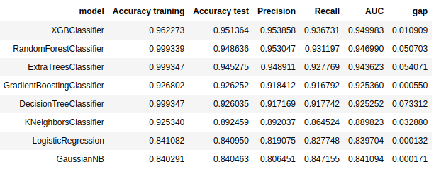

# Europe-Hotel-Satisfaction-Score

### Влияние фичей на satisfaction
Фичи выбранные самостоятельно до обучения
1. Type of Booking
2. Type of Travel
3. Hotel wifi service
4. Ease of Online booking
Остальные фичи выделяются менее сильно, однако видно, что они также имеют корреляцию с satisfaction, в особенности фичи связанные с Rate
Фичи считающиеся моделью важными после обучения
1. Type of Booking
2. Hotel wifi service
3. Common Room entertainment

### Результаты и выбор метрик
Т.к. таргет классы распределенны равномерно(neutral or dissatisfied: 0.552111, satisfied: 0.447889), то результатам accuracy можно доверять.
Также мудем смотреть на результаты Precision,	Recall и AUC.
Использовалась кроссвалидация для оценки качества работы модели.
Обучались сразу несколько распростаненных моделей классификации:

